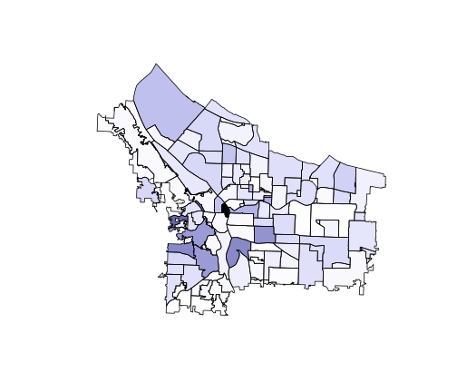
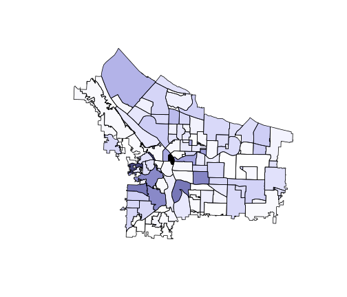
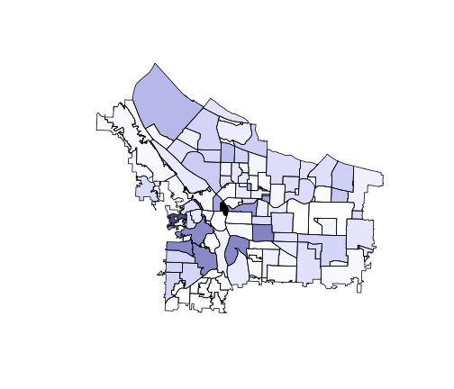
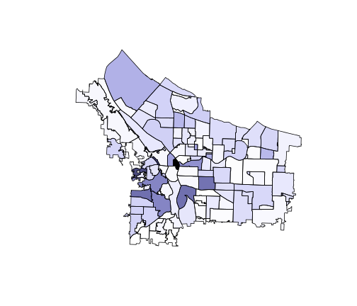
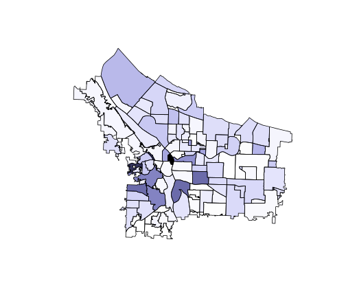
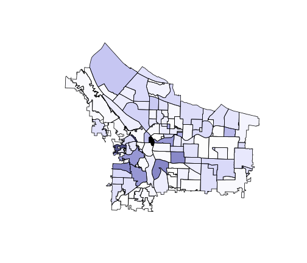
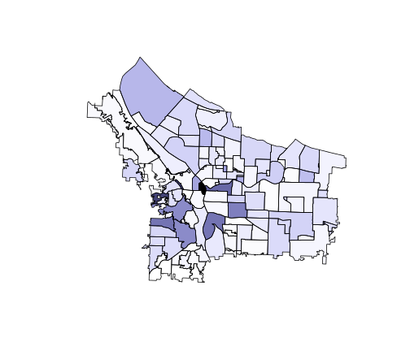

Consecutive Yearly Maps
========================================================

Each consecuative year of reported crime in Portland is shown here. This will help me to determine if there is a clear pattern in the crime levels between each neighborhood.


Maps shown by year:


```r
plot.map(2004)
```

 

```r
plot.map(2005)
```

 

```r
plot.map(2006)
```

 

```r
plot.map(2007)
```

 

```r
plot.map(2008)
```

 

```r
plot.map(2009)
```

 

```r
plot.map(2010)
```

 

```r
plot.map(2011)
```

 

```r
plot.map(2012)
```

 

